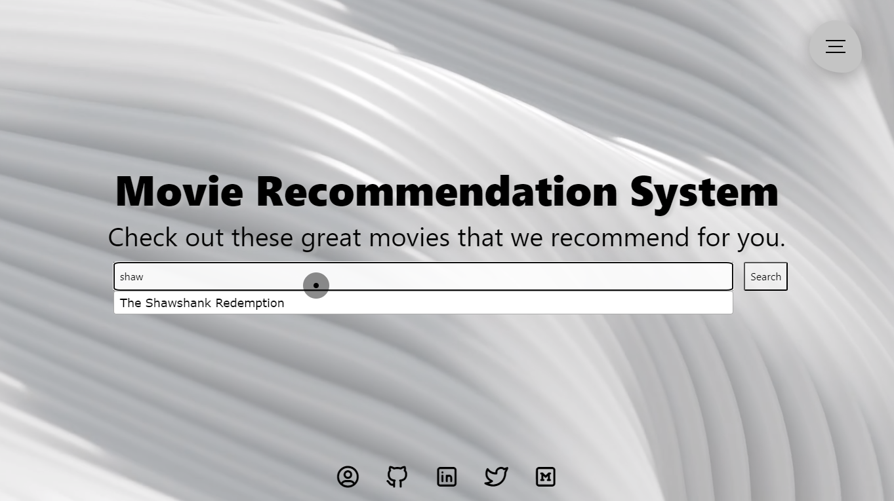

# Movie Recommendation System (MRS)

This repository contains all the project files and necessary details about applications required to run the project on your local machine as well as host it as a Django Application on your Server/Domain.

| Title                                    | Description                                                                                                         |
| ---------------------------------------- | ------------------------------------------------------------------------------------------------------------------- |
| Demo :movie_camera:                      | Sample Demo of MRS Hosted on free cloud PaaS                                                                        |
| Requirements :heavy_check_mark:          | Requirements and essential links to get started with the project locally                                            |
| Model Training :small_red_triangle_down: | How the MRS was trained for Demo as well as on Large Movie Dataset from Kaggle                                      |
| Project Versatility :page_with_curl:     | Reference documentation of how to plug in any general recommendation model into this project and host it on servers |
| Troubleshooting Issues :muscle:          | Guide to resolve errors faced during reproducibility                                                                | To be Updated                                                                                                              |

Do you like it? :heart: Follow me on Twitter, GitHub, & LinkedIn to say Hi :wave:

<hr>

## 1. Demo :movie_camera:

In this section, we try to understand through video demo to play around the project and what all can be achieved through it.

1. Movie Recommendation System Hosted Application Demo

2. Running MRS on local System

3. Sample Screenshots

   1. Home Screen

      

   2. Navigation Screen

      

   3. Search with Auto Suggestion

      

   4. Recommended Movies

      


____

***Please be slightly patient while I create and upload the demo video. Follow and star this project to get latest notifications and update. :raised_hands:***

<hr>

## 2. Requirements :heavy_check_mark:

To build this project without any errors/issues, the following requirements needs to be satisfied:

1. Create a Virtual Environment using python>=3.8 (Tested on 3.9.16)

2. Install the dependencies from the requirements text file from the repository.

<hr>

## 3. Model Training :small_red_triangle_down:

### 3.1 Training & Inference

For a complete guide to training your model and inference using the trained model, refer to the Movie Recommendation System Python Notebook.

### 3.2 Django Web Application Integration

Here is a detailed blog explaining the complete approach and directory structure essential to understand Django integration.

<hr>

## 4. Project Guide :page_with_curl:

### 4.1 Running it OnRender Free Cloud

Here is a detailed blog explaining the complete approach and essential details to deploy not just this application but also any other web-application you like to build.

### 4.2 Running in Local

I am assuming you have completed section 2 in the above reference for creating your environment. Let's start by activating it.

```shell
/path/to/env/bin/activate
